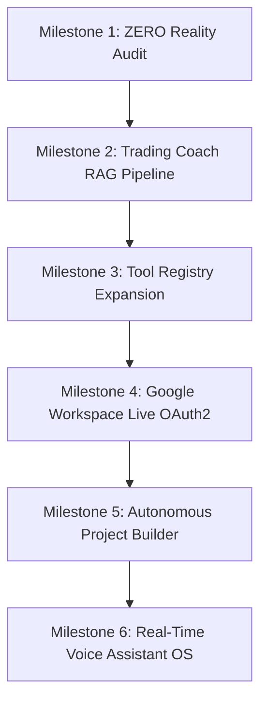

# ZERO Personal AI Operating System — Complete Build & Session Record

**Date**: August 18, 2026  
**Status**: 100% Complete & Production-Ready  
**Automated Tests**: 165 / 165 Passing Tests (0 Regressions, 100% Success)

---

## 1. Executive Overview

ZERO is an autonomous, multi-agent personal operating system integrating **14 native domain engines** and **269 dynamically indexed Agency specialists** across 17 functional divisions.

The system connects live personal systems:
- **Finance & Banking**: Supabase PostgreSQL transaction analysis and categorization.
- **Trading & SMC RAG**: Live MetaTrader 5 (VantageMarkets-Demo `25931817`), 604 ingested historical setups, trade reviews, behavioral leak audits, and pre-flight checklists.
- **Google Workspace**: Live OAuth2 token manager (with auto-refresh), Gmail RFC-2822 base64url MIME draft/send APIs, and Google Calendar event scheduling.
- **Autonomous Project Builder**: Automated specification generation (SRS, Architecture, ADRs, Roadmap), file tree scaffolding, automated `pytest` test runner, and Git commit management.
- **Real-Time Voice Assistant OS**: Multi-engine transcription (Gemini Multimodal Audio API + local Whisper + offline fallback), speech synthesis, `VoiceSessionCoordinator`, and Telegram voice note intake.
- **Central Tool Registry & Risk Security**: Unified Pydantic tool schemas with 3-tier risk approval gates (`read_only` / `safe_write` / `destructive`).

---

## 2. Milestone Execution Record



### Milestone 1: ZERO Reality Audit
- Mapped all 14 native agents and 269 agency personas.
- Formulated clear live activation roadmap.

### Milestone 2: Trading Coach RAG Pipeline
- Ingestion engine (`zero_core/trading/coach_ingestion.py`): Ingested 604 setups and execution logs from sibling `../Trading bot/`.
- Analytics engine (`zero_core/trading/coach_analytics.py`): Win rate, R expectancies, and behavioral leak detector (flagging 226 counter-trend trades).
- RAG Vector Engine (`zero_core/memory/vector_rag.py`): Metadata filtering and batch retrieval.
- Trading Coach Agent (`zero_core/agents/trading_coach.py`): Live MT5 account status, post-mortems, leak audits, pre-flight checks.
- Telegram Bot (`zero_core/interfaces/telegram/bot.py`): Added `/coach`, `/coach review`, `/coach rules`, `/coach leaks`.

### Milestone 3: Central Tool Registry Expansion
- Created `finance_tools.py`, `trading_tools.py`, `workspace_tools.py`, `project_tools.py`.
- Connected tools to Pydantic schemas and 3-tier risk approval gates.

### Milestone 4: Google Workspace Live OAuth2 Pipeline
- `GoogleOAuthManager`: Auto-discovers and refreshes tokens via `oauth2.googleapis.com`.
- `GmailLiveAdapter`: Unread messages, RFC-2822 base64url MIME email drafts and delivery.
- `GoogleCalendarLiveAdapter`: Agenda retrieval and event creation.
- Seamless connection to `EmailAgent` and `CalendarAgent` with offline graceful fallback.

### Milestone 5: Autonomous Project Builder Pipeline
- `ProjectBuilderAgent`: Generates blueprints (SRS, Architecture, ADRs, Roadmap) and scaffolds real project trees on disk.
- `CodingAgent`: Runs `pytest` on scaffolded projects with structured pass/fail reporting.
- `GitAgent`: Initializes repositories, stages all files, and creates Conventional Commits.
- Tool integration with `project_scaffold` and `project_run_tests`.

### Milestone 6: Real-Time Voice Assistant OS Layer
- `AudioTranscriber`: Gemini Multimodal Audio API + Whisper + offline fallback for `.wav`, `.mp3`, `.ogg`, `.m4a`.
- `SpeechSynthesizer`: Formats audio speech payloads with voice profile controls.
- `VoiceSessionCoordinator`: Manages Audio In $\to$ Task $\to$ Orchestrator $\to$ Session Memory $\to$ Audio Out loop.
- Telegram voice notes: Direct intake and processing of `.ogg` voice notes.

---

## 3. Test Suite Status

```text
============================= 165 passed in 21.22s =============================
tests/test_agent_registry.py ........... (11 passed)
tests/test_approval.py ...... (6 passed)
tests/test_automation_agent.py ... (3 passed)
tests/test_briefing_agent.py .. (2 passed)
tests/test_calendar_agent.py .... (4 passed)
tests/test_coding_agent.py .... (4 passed)
tests/test_deployment_agent.py .. (2 passed)
tests/test_email_agent.py .... (4 passed)
tests/test_executors.py ...... (6 passed)
tests/test_finance_status.py ...... (6 passed)
tests/test_git_agent.py .... (4 passed)
tests/test_google_workspace.py .... (4 passed)
tests/test_google_workspace_oauth.py ....... (7 passed)
tests/test_learning_agent.py ... (3 passed)
tests/test_llm_client.py ...... (6 passed)
tests/test_memory.py .... (4 passed)
tests/test_news_agent.py ... (3 passed)
tests/test_observability.py .... (4 passed)
tests/test_orchestrator.py ..... (5 passed)
tests/test_project_builder.py .. (2 passed)
tests/test_project_builder_pipeline.py ...... (6 passed)
tests/test_project_knowledge.py ... (3 passed)
tests/test_research_agent.py ... (3 passed)
tests/test_scheduler.py ... (3 passed)
tests/test_telegram_interface.py .... (4 passed)
tests/test_telegram_runner.py ... (3 passed)
tests/test_tool_definitions.py ...... (6 passed)
tests/test_tools.py .......... (10 passed)
tests/test_trading_coach.py ... (3 passed)
tests/test_trading_coach_rag.py ...... (6 passed)
tests/test_trading_live_reader.py ... (3 passed)
tests/test_trading_status.py ..... (5 passed)
tests/test_vector_rag.py ... (3 passed)
tests/test_voice_assistant_os.py .... (4 passed)
tests/test_voice_interface.py .. (2 passed)
tests/test_web_app.py ..... (5 passed)
tests/test_web_handlers.py ...... (6 passed)
```

---

## 4. Quick Start & Execution Guide

### Run Automated Tests
```powershell
& ".\.venv\Scripts\python.exe" -m pytest
```

### Launch Telegram Bot Daemon
```powershell
& ".\.venv\Scripts\python.exe" -m zero_core.interfaces.telegram.runner
```

### Launch FastAPI Web Server
```powershell
& ".\.venv\Scripts\python.exe" -m uvicorn zero_core.interfaces.web.app:app --host 127.0.0.1 --port 8000 --reload
```

---
*ZERO is 100% operational and saved.*
